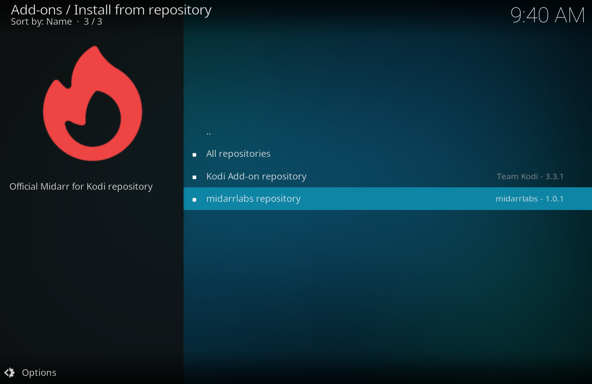
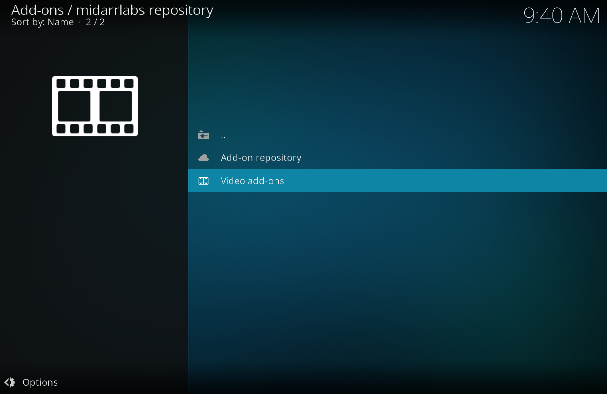
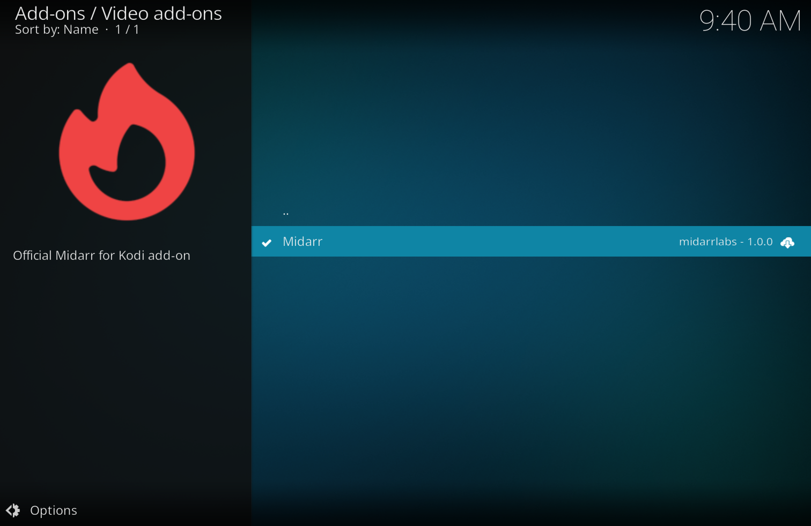
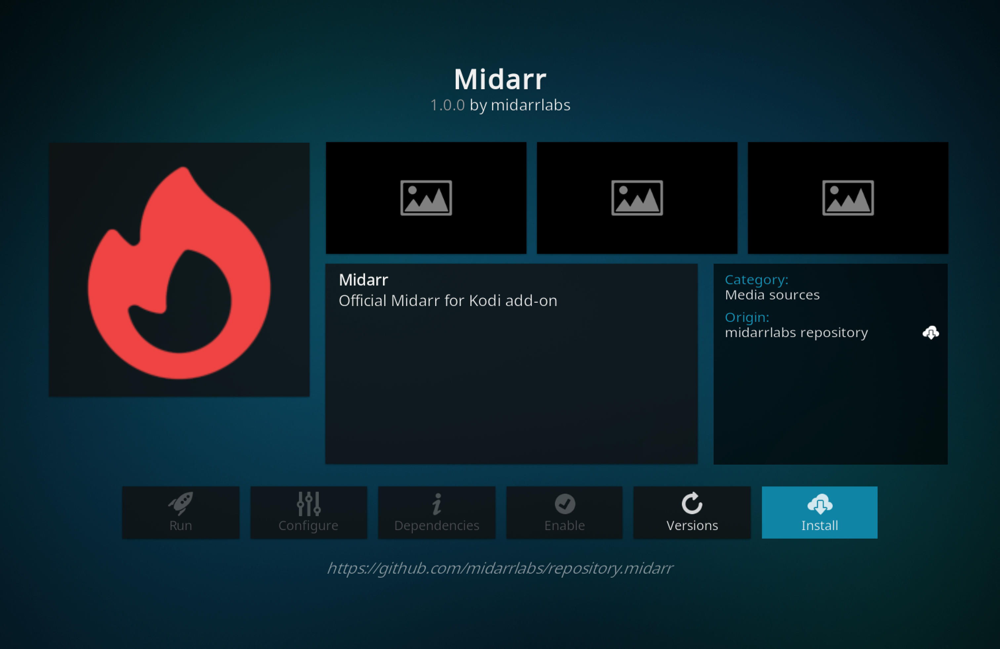
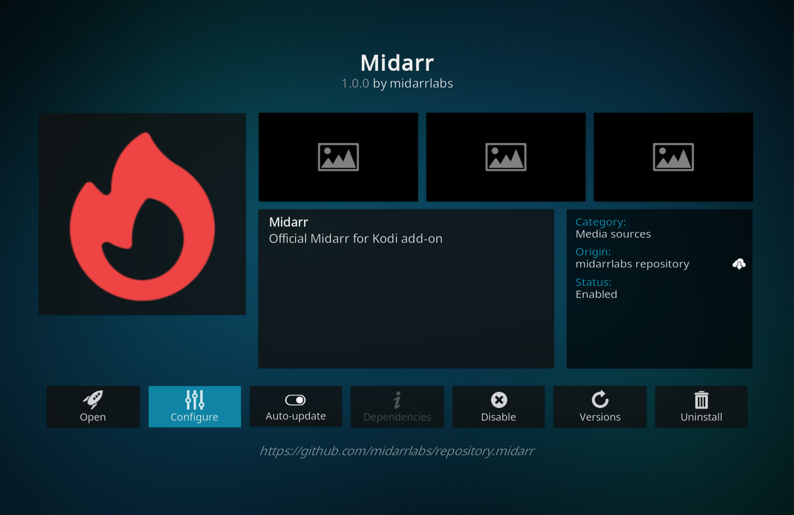
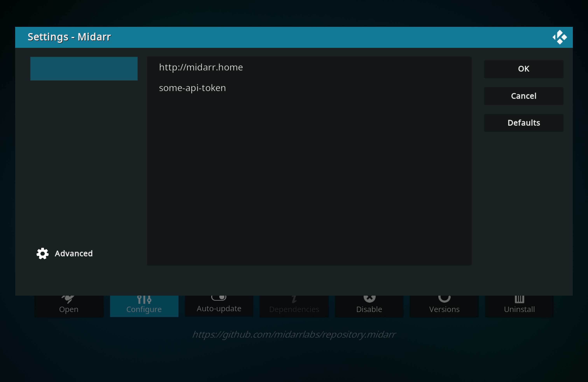

## Midarr for Kodi repository

Contains Midarr for Kodi add-on.

### Installation

1. Add repository:

```bash
https://midarrlabs.github.io/repository.midarr/
```

2. Install Midarr:






3. Configure settings:

Enter your server url and API token


